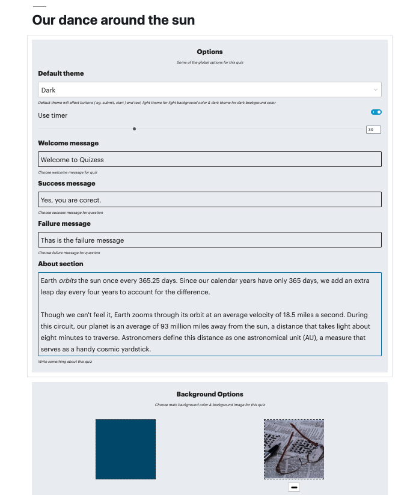
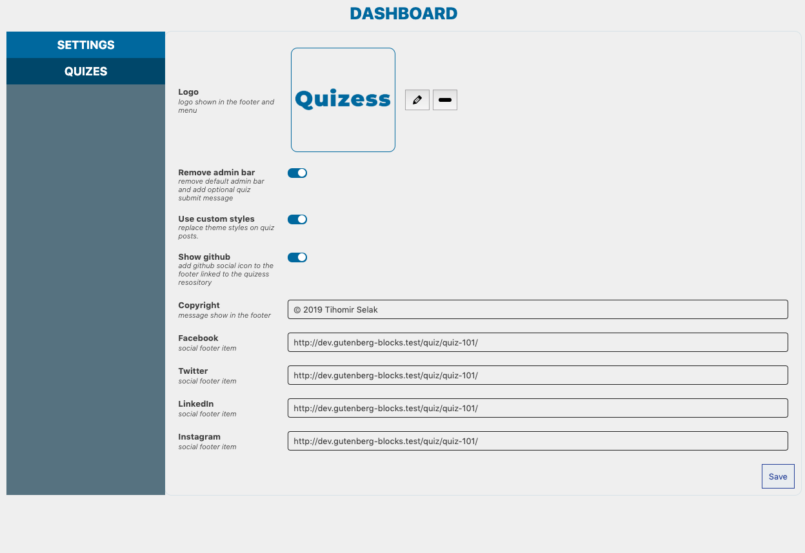

<p align="center">
  
</p>

# Quizess

This is **Gutenberg** **Wordpress** plugin, that allows you to create quizess, register players and keep records on player scores.

Gutenberg allows us use Wordpress in more versatile way. Using block templates we can add custom options to posts.

<p align="center">
  
</p>


Or add different required fields.

<p align="center">
  
</p>


## Technologies
**OO PHP** + **React** for *blocks*, *admin dahboard*, *menu* and *frontend quiz*. Plugin utilizes **REST Api** to decouple Wordpress backend and UI. That way we can use frontend libraries (like React, VUE, Angular) to create Web Apps and still use Wordpress for backend, we can also extend Wordpress admin.

<p align="center">
  
</p>


## Requirements

1. [Node.js](https://nodejs.org/en/)
2. [Composer](https://getcomposer.org/)
3. Local server - [PHP 7+](http://www.php.net/)
4. [Wordpress](https://hr.wordpress.org/)

## Instalation

Clone this repository into plugins folder

## Development

Builds assets in watch mode using Webpack.

```bash
npm start
```

## Build

Builds production ready assets

```bash
npm run build
```


## Credits

This plugin is created with help of [Infinum WordPress Plugin Boilerplate](https://github.com/infinum/wp-boilerplate-plugin) repository that contains all the tools you need to start building a modern WordPress plugin, using all the latest front end development tools.

* [Tihomir Selak](www.tihomir-selak.from.hr)
* [tknox.de@gmail.com](tknox.de@gmail.com)

## License

Quizess is free software, and may be redistributed under the terms specified in the LICENSE file.
