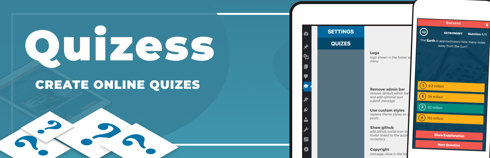

<p align="center">
  
</p>

# Quizess

This is **Gutenberg** **Wordpress** plugin, that allows you to *create* quizess, *register* players and keep records on player *scores*. It is an excellent solution for creating quiz games in Wordpress.

**Options:**
+ **Custom syle.** Use own theme header & footer, or use Quizess styling with custom logo, menu & social links. With option to remove login WordPress admin bar on Frontend.
+ **Track scores.** Option to track scores on per quiz basis. If registered player exits the the quiz before end, the scores will be sent, with all unanswered question as negative. Check records for quizes in admin dashboard.
+ **Lock quiz.** Option to show quiz only to registered players.
+ **Single submit.** Players can play quiz once. It allows admin to check player scores, as player will be locked out of the quiz until approved again, by disabling options or by removing last attempt scores from players records.
+ **Single quiz options.**  customize quiz messages text, add about text, add timer for questions, choose quiz background color, image and theme.
+ **Question topics.** Groups question by topic, eg. History, Astronomy, and import them as a group to quiz.
+ **Single question options.**  Add question text, answers and optional explanation text and media - image, video, youtube, lottie.

## Preview

<p align="center">
  
</p>

### Quiz CPT

With Gutenberg custom block and block templates we have more flexibility in expanding posts while saving all options as attributes.

<p align="center">
  
</p>

### Dashboard

By having React in Worfpress we can quickly create admin interfaces.

<p align="center">
  
</p>


## Technologies
**OO PHP** + **React** for *blocks*, *admin dahboard*, *menu* and *frontend quiz*. Plugin utilizes **REST Api** to decouple Wordpress backend and UI. That way we can use frontend libraries (like React, VUE, Angular) to create Web Apps and still use Wordpress for backend, we can also extend Wordpress admin.


## Requirements

1. [Node.js](https://nodejs.org/en/)
2. [Composer](https://getcomposer.org/)
3. Local server - [PHP 7+](http://www.php.net/)
4. [Wordpress](https://hr.wordpress.org/)

## Instalation

Clone this repository into plugins folder

## Development

Builds assets in watch mode using Webpack.

```bash
npm start
```

## Build

Builds production ready assets

```bash
npm run build
```


## Credits

This plugin is created with help of [Infinum WordPress Plugin Boilerplate](https://github.com/infinum/wp-boilerplate-plugin) repository that contains all the tools you need to start building a modern WordPress plugin, using all the latest front end development tools.

* [Tihomir Selak](www.tihomir-selak.from.hr)
* [tknox.de@gmail.com](tknox.de@gmail.com)

## License

Quizess is free software, and may be redistributed under the terms specified in the LICENSE file.
